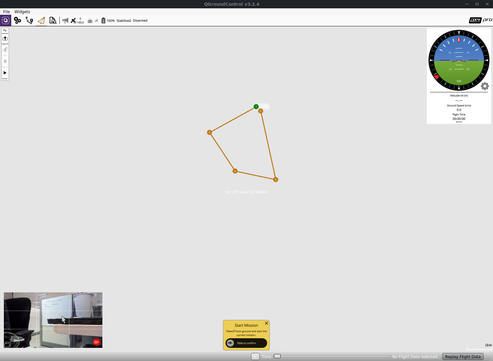

# Camera streaming

Since Intel Aero operating system image 1.4, it comes preloaded with
[Camera Streaming Daemon](https://github.com/01org/camera-streaming-daemon/),
that is a daemon to stream available video streams using the RTSP protocol.

## Getting the list of streams

The Camera Streaming Daemon running in Aero is by default publishing all the
streams using zeroconf, so from a Linux host machine with Avahi (Linux
implementation of zeroconf) running you can get the list streamings with:
`avahi-browse -a -r -t`

In the output you should have something like:
``` console
= wlp58s0 IPv4 /video13                                      _rtsp._udp           local
   hostname = [intel-aero.local]
   address = [192.168.8.1]
   port = [8554]
   txt = ["name=Intel RealSense 3D Camera R200" "frame_size[0]=YUYV(1920x1080,1280x720,960x540,848x480,640x480,640x360,424x240,320x240,320x180)" "frame_size[1]=pRAA(2400x1081)"]
= wlp58s0 IPv4 /rsdepth                                      _rtsp._udp           local
   hostname = [intel-aero.local]
   address = [192.168.8.1]
   port = [8554]
   txt = ["name=RealSense Depth Camera" "frame_size[0]=NV12(640x480)"]
= wlp58s0 IPv4 /rsir                                         _rtsp._udp           local
   hostname = [intel-aero.local]
   address = [192.168.8.1]
   port = [8554]
   txt = ["name=RealSense Infrared Camera" "frame_size[0]=NV12(640x480)"]
= wlp58s0 IPv4 /rsir2                                        _rtsp._udp           local
   hostname = [intel-aero.local]
   address = [192.168.8.1]
   port = [8554]
   txt = ["name=RealSense Infrared Camera2" "frame_size[0]=NV12(640x480)"]
```

Or you can build the Camera Streaming Daemon samples and just run
`camera-sample-client` that should give you a more clean output:

``` console
Service resolved: '/rsir2' (rtsp://192.168.8.1:8554/rsir2)
TXT: ["name=RealSense Infrared Camera2" "frame_size[0]=NV12(640x480)"]
Service resolved: '/rsir' (rtsp://192.168.8.1:8554/rsir)
TXT: ["name=RealSense Infrared Camera" "frame_size[0]=NV12(640x480)"]
Service resolved: '/rsdepth' (rtsp://192.168.8.1:8554/rsdepth)
TXT: ["name=RealSense Depth Camera" "frame_size[0]=NV12(640x480)"]
Service resolved: '/video13' (rtsp://192.168.8.1:8554/video13)
TXT: ["name=Intel RealSense 3D Camera R200" "frame_size[0]=YUYV(1920x1080,1280x720,960x540,848x480,640x480,640x360,424x240,320x240,320x180)" "frame_size[1]=pRAA(2400x1081)"]
```

!!! Note
	The ip address show in here is the one from Aero WiFi access point
	interface, it will be a different IP if you are connected by other means.

## Watching the stream using VLC

`vlc rtsp://192.168.8.1:8554/video13`

!!! Note
	Due the VLC implementation it has a latency of 2 seconds.

## Watching the stream using GStreamer

`gst-launch-1.0 rtspsrc location=rtsp://192.168.8.1:8554/video13 latency=0 ! decodebin ! autovideosink`

!!! Note
	The latency=0 parameter does the trick to reduce the latency to a
	minimum, if you want a more smooth streaming remove it.

## Watching the stream using QGroundControl

[QGroundControl](http://qgroundcontrol.com/) still doesn't have support to
autodetect the streamings but you can still see the streaming if you set it manually:
[](img/camera/qgc_streaming_step1.png)
[](img/camera/qgc_streaming_step2.png)
[](img/camera/qgc_streaming_step3.png)

## Lowering the stream resolution

When streaming over WiFi on a environment with multiple WiFi networks it can
cause some freezes on the stream, you can reduce this freezes by lowering the
stream resolution. To do that you need to check all the resolutions supported
by the stream and set the resolution desired on the URL.

`gst-launch-1.0 rtspsrc location='rtsp://192.168.8.1:8554/video13?width=640&height=480' latency=0 ! decodebin ! autovideosink`

Other alternative should be change the WiFi band frequency to 5GHz but it will reduce the range and the WiFi module in Aero only works it in client mode.
